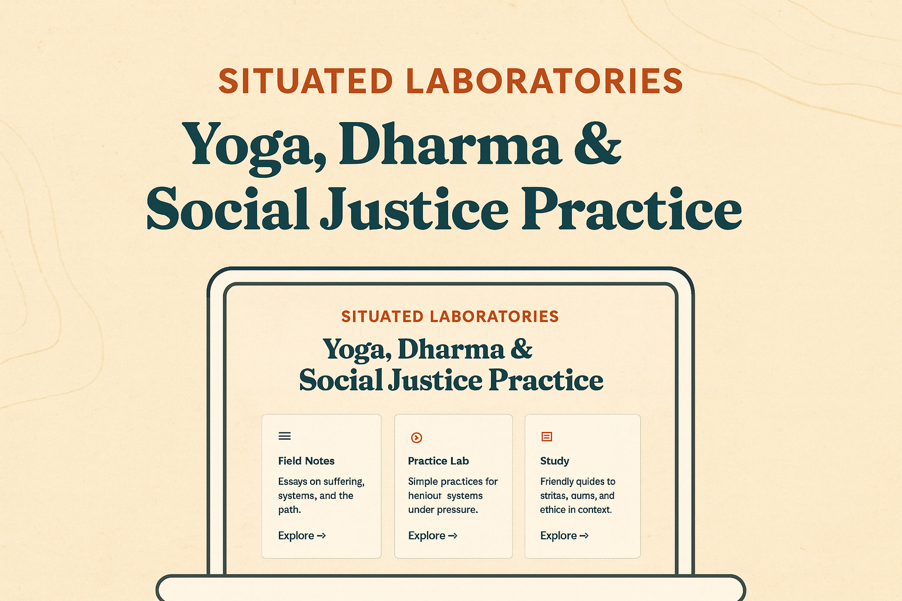

# Situated Laboratories

**Yoga, Dharma & Social Justice Practice**  
*Experiments in liberation for a burning world.*

A place for Buddhist insight, Ashtanga yoga, and collective liberation. Essays, study guides, and simple practices for people dealing with burnout, climate grief, political anxiety, and everyday suffering — without gurus, spiritual bypass, or toxic positivity.



---

## What This Is

Situated Laboratories is a home for practice, study, and experiment with Buddhist insight, Ashtanga yoga, and collective liberation. It offers:

- **Field Notes** — Essays on suffering, systems, and the path
- **Practice Lab** — Simple audio practices for nervous systems under pressure
- **Study** — Friendly guides to sutras, suttas, and ethics in context

Each life is an experiment in liberation. Practices are tested in real conditions — insomnia, grief, burnout, solidarity work — and refined honestly.

---

## Core Commitments

### Grounded Practice

Short, realistic practices for daily life, not aspirational retreats. Practices acknowledge systemic causes of burnout, not just "self-care."

### Integration of Dharma, Yoga, and Justice

How the Four Noble Truths, the Eightfold Path, and the eight limbs of yoga speak directly to:
- Structural harm
- Climate crisis
- Digital overload
- Collective struggle

### Honest Stories

Essays and reflections that name power and systems (capitalism, white supremacy, digital fascism) while always coming back to: *What does this mean for practice in a nervous system and a body?*

### Accessibility & Justice

- Transcripts for all audio practices
- High-contrast design and legible typography
- Keyboard navigation throughout
- No autoplay media
- Privacy-respecting (no tracking, no surveillance tech)

---

## What This Is Not

**This site offers educational and spiritual material, not professional clinical care.**

- Not therapy
- Not medical advice
- Not crisis support

If you are in immediate distress, please contact local emergency services or a crisis resource. In the U.S., call or text **988** for the Suicide & Crisis Lifeline.

---

## Boundaries & Ethics

Material may touch on trauma, grief, and substance use, but it is not therapy or medical advice. Please seek licensed therapists, medical providers, or crisis resources when needed.

This work is offered freely. If you find it helpful and can afford it, you're invited to support it through dana (generosity), but this is not required — all content remains freely accessible.

---

## Getting Started

### For Visitors

Visit the site to explore:
- **Field Notes** — Read essays on practice, systems, and liberation
- **Practice Lab** — Try audio practices (5-20 minutes)
- **Study** — Learn about dharma foundations, yoga, and ethics

### For Developers

This site is built with [Astro](https://astro.build), a static site generator. To run locally:

```bash
npm install
npm run dev
```

Visit `http://localhost:4321` to see the site.

---

## Content Cadence

- **Field Notes:** Aim for 1 essay every 2-4 weeks (adjustable)
- **Practices:** Aim for 1 new practice every 1-2 months
- **Study materials:** Added as capacity allows

This is a guideline, not a requirement. Adjustments happen based on capacity and energy.

---

## Support

If you find this helpful and can afford it, you're invited to support it through dana (generosity). See the Support page for more information.

---

## License

This project is open source and available under the [MIT License](LICENSE).

**Code:** MIT License - Feel free to use, modify, and distribute.

**Content:** Essays, practices, and study materials are shared with generosity. Please attribute when sharing or adapting.

---

> "Freedom is not found by escaping conditions, but by seeing clearly how we are conditioned — and responding with wisdom instead of habit."